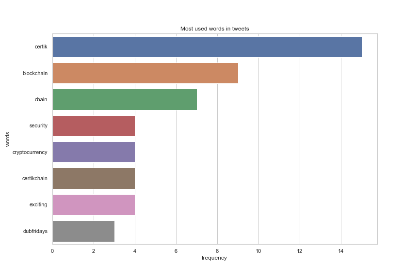
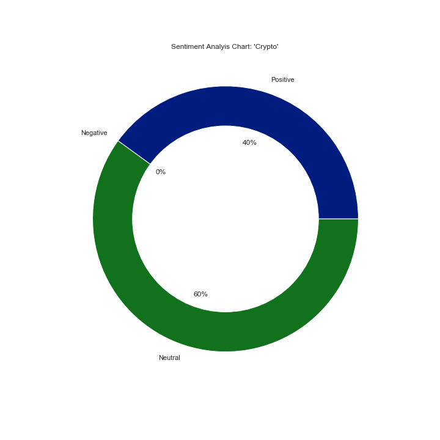

# Sentiment Analysis

## About
In this section tweets are retrieved via tweepy API and are analysed in ouput formats of barchart, piechart and wordcloud.

### Main Script (sentiment_analysis.py)
The main script for sentiment analysis can be run via docker from the project root directory:

- Build docker image

```sh
$ docker build -t sentiment-analysis .
```

- Run docker image
  
```sh
$ docker run sentiment-analysis
```

Sample Output:

    {'data':
         {'positive': 40.0, 'negative': 0.0, 'neutral': 60.0},
    'status': 'success'}

The `main` function accepts a keyword that can be used to filter tweets before sentiment analysis is finally computed.

### Analysis (analysis.ipynb)
This notebook has the logics for fetching tweets via tweepy to computing sentiment analysis, word cloud and word frequency bar chart. The tweets are cleaned via helper functions to reduce noise in the final outputs and charts.

Sample Word Cloud Chart on all tweets from certikOrg


Sample Word Frequency Chart on all tweets from certikOrg


Sample Pie Chart on tweets with keyword 'crypto' from certikOrg



